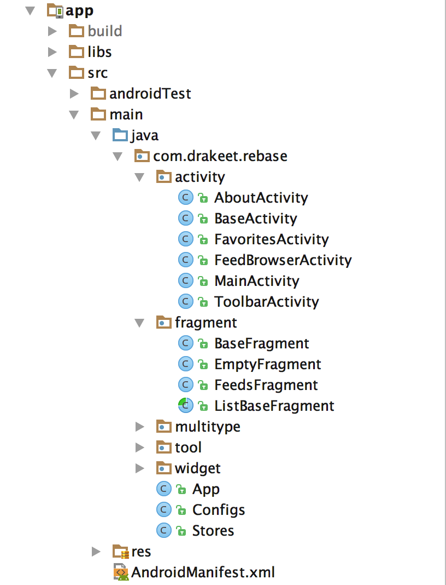
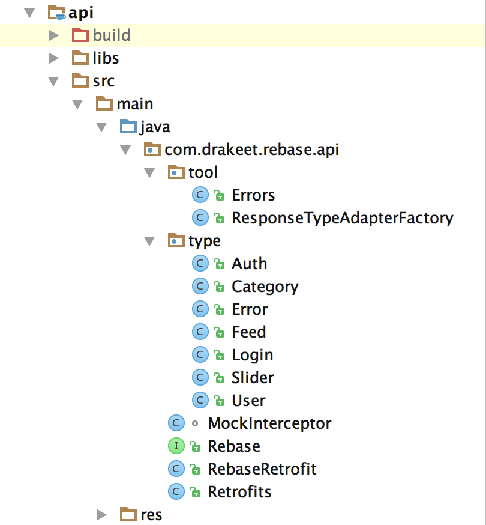

# Rebase Android 


注：本项目还没正式公开或发布，仍然处于建设中。

## 结构

Rebase 采用了极简而精巧的结构、包设计，令每个人都能轻易参与和阅读。采用 `api` / `app` / `web` 三层结构：



### How to Contribute

请使用 **DrakeetAndroid([drakeet_style.zip](code_style.zip))** 代码风格配置文件，以保持统一。提交 Pull Request 请确保你的格式没有任何问题，包括该有的各种空格。

That's all. You're good to go!


## 其他

这个项目将在 README 优先使用中文。目前处于第一个公开版本，尽管如此，它仍然经过精心设计和编码，极力追求简单直观，采用原生模式开发，没有很绕的关系，做了适当而不复杂的分层，继承关系克制，能组合的组合，能内聚的尽量内聚。布局文件十分讲究，styles、values 分明，代码干净、格式一丝不苟，易读易协作，可拷贝可复用。

如果你有任何问题或提供工作方面的机会，请提 issue 或致信我的邮箱 drakeet.me@gmail.com

# 开源协议

```
Rebase Android 基于 GPL-3.0 开源协议，在使用本项目代码的之前请确保你了解这个协议。
详细内容参见：https://github.com/drakeet/rebase-android/blob/master/LICENSE
```
